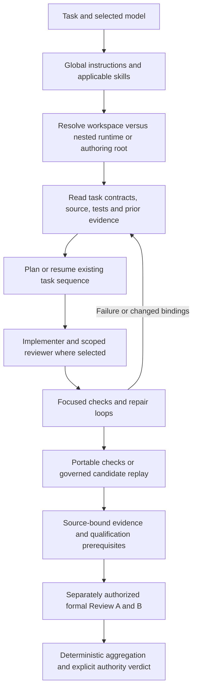
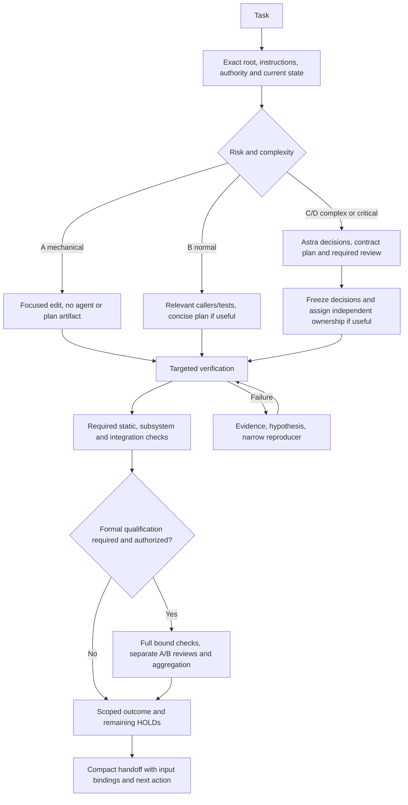

# Codex workflow audit — 2026-09-08

## A. Executive Summary

- Implemented a small workspace `AGENTS.md` and an on-demand workflow guide. No runtime, test, dependency, CI, global configuration, sealed pack, or authority changes.
- This is a multi-repository authoring/review workspace, not a single application. The outer Git repository has no commit; the inspected repair runtime is at `dd9d081ca9a04ac586203fb7b23d18cf40fc0b4a`.
- Inventory found 69 nested `AGENTS.md` files with only 10 distinct contents, 17 top-level pre-fix runtime snapshots, and 315 workflow/configuration file entries. Identical archived instructions need no repeated semantic reading.
- Sampled 60 project session logs, including 58 child-agent logs, from the September 2026 active-session directory. Current audit excluded; this is a multi-day sample, not a typical-task benchmark or complete lifetime history.
- Observed 59 spawn calls, 1,900 agent waits, 1,323 messages, and 173 follow-ups. These counts do not establish peak concurrency or prove that every interaction was wasteful.
- Existing strengths: 52 of 59 dispatches explicitly used `fork_turns=none`; focused tests, offline dependency pins, generated-asset boundaries, and formal review independence already exist.
- Decoded 6,750 literal shell `cmd` fields; 563 repeated earlier command strings. Identical text can legitimately run against changed code, another cwd, or new qualification inputs.
- Large output requests and rediscovery are measurable: 1,694 recorded output-budget requests were at least 20,000 tokens; 368 stored tool-output records contain the word `truncated`.
- A confirmed invalid dispatch used `gpt-5.6-astra`; the tool rejected it. The available model is `gpt-6-astra`.
- Desktop configuration defaults to Astra High; the inspected WSL CLI defaults to Terra Medium. Actual session settings varied. Expensive mechanical-task overuse is a risk, not proven from model defaults alone.
- A concrete workflow defect: the runtime README's old individual full-verifier flags disagree with the current executable's `--config` interface. The new guide records the correct interface without altering governed inputs.
- Expected benefit: HIGH potential reduction in avoidable orchestration/context work; exact account-quota savings are unmeasured. More precise routing and unchanged critical checks should preserve quality, but no controlled before/after trial has yet demonstrated that result.
- Fresh validation found existing Python static-check failures: Ruff reports 28 errors; mypy reports 163 errors in 29 files. TypeScript and ESLint pass. See J for complete results and scope.

Evidence and methodology: [audit-evidence-2026-09-08.json](audit-evidence-2026-09-08.json). Operating instructions: [workflow.md](workflow.md). These audit artifacts are reference material, not startup instructions or qualification receipts.

## B. Current Workflow



Not every task reaches formal qualification. The sampled history mixes plan repair, bootstrap, portability, clock, browser, durability, review, and follow-up work.

| Stage | Observed model/reasoning | Context, tools and handoff | Checks/artifacts and repetition | Cost proxy / quality benefit |
| --- | --- | --- | --- | --- |
| Startup | Desktop default Astra High; historical parent also Terra High, Sol Medium, Astra Low | Global instructions, skills, memory lookup, Git and path discovery | No root orientation existed; nested repositories carry separate state | Medium context burden; essential target/authority identification |
| Reconnaissance | Mixed parent/worker models; exact stage attribution unavailable | `rg`, reads, Git, source and nearest tests; graph index available | 360 decoded commands contain `rg --files`; archive duplicates amplify broad search | High potential duplication; strong benefit when establishing actual interfaces |
| Planning | Mixed settings; not attributable to every document | Sealed task manifests, implementation plan, task briefs and old review findings | Bootstrap/rebind plan plus generated task cards and staged successor plans | High for critical contracts; extra planning for mechanical work unproven |
| Implementation | Dispatches commonly Sol High or Astra High | Narrow worker tasks; most use no inherited history | Code/tests, per-task evidence, follow-ups | Valuable for isolation; coordination overhead increases with prolonged chains |
| Debugging | High reasoning common in workers | Targeted pytest/Node checks, captured failures and repairs | One literal process-crash test command requested 19 times in one worker | High retry proxy; state/recovery changes justify substantial investigation |
| Verification | Same worker/coordinator context; shell tools perform deterministic work | Package scripts, registry self-check, portable/full verifier | Compilation, selected execution, collection, source-bound receipts | Necessary assurance; avoid duplicate same-input invocations outside required gates |
| Review | Astra/Terra/Sol settings vary | Worker review/fix-review; separate signed formal review topology | Distinct A/B workspaces, role attestations and aggregation | High safety value; ordinary extra review chains need a scope-based reason |
| Resume/closure | Settings can change between turns | Prior task output, evidence records, Git identity and dirty state | Long history and report amendments; local and formal verdicts separate | Useful continuity; old summaries are pointers, not current proof |

Inspection covered root/nested instructions, runtime manifests, ESLint/pytest/Ruff/mypy configuration, the GitHub workflow, verifier/controller entry points, authoring tools and task/command registries, review contracts/configs, developer/repair documents, current skill policies, global hooks, and the Hermes wrapper. All ten distinct instruction variants were compared; archived copies were inventoried and hash-grouped, not all reread. No root Makefile, justfile, Taskfile, package manifest, or `.codex` configuration was found in the workflow inventory. No hosted CI run was queried or launched.

The Codebase-Memory index exists for both the runtime and controller worktree; its runtime architecture map aided orientation. Source reads, rather than an assumed fresh graph, established the commands discussed here. Serena tools were not exposed, although global Serena hooks are configured. No source-symbol edit required a fallback refactor tool.

## C. Top Quota Waste Sources

Ranking is an evidence-based priority estimate, not a measured share of quota.

| Rank | Source | Evidence | Potential impact | Quality benefit of current work | Action |
| --- | --- | --- | --- | --- | --- |
| 1 | Long orchestration chains | 1,900 waits, 1,323 messages, 173 follow-ups, 59 spawn calls | HIGH | Review and progress coordination can be essential | Zero to two ordinary workers; completion-driven waits; messages only for decisions or changed state |
| 2 | Rediscovery across many copies | 17 top-level snapshots; 69 instruction files/10 unique contents; 360 decoded commands contain `rg --files` | HIGH | Initial reconnaissance is valuable; duplicate copies add little | Select exact nested root once; narrow search; reuse unchanged facts |
| 3 | Large outputs and repeated instruction loading | 1,694 budgets ≥20,000; 368 stored output records containing `truncated`; shell-script text contains 347 `SKILL.md` mentions | HIGH | Full logs help diagnosis; dumping all of them rarely does | Keep full local logs and return bounded summaries/ranges |
| 4 | Retry loops and command duplication | 563 repeated literal command strings; one crash-test selector requested 19 times | HIGH, conditional | Crash/recovery proofs must stay strong | Record hypothesis and changed input before retry; retain necessary fresh proof |
| 5 | Ambiguous/stale entry points | Root had no instructions; README old full flags force HOLD; authoring checkout already dirty | MEDIUM–HIGH | Versioned sources and fail-closed behavior are necessary | Add orientation and executable-interface caveat; preserve snapshots and dirty work |
| 6 | Broad model default and routing mistakes | Desktop Astra High; one rejected `gpt-5.6-astra` dispatch | MEDIUM, unbenchmarked | Astra High is justified for much of this actual critical work | Supported model matrix; reduce effort for deterministic follow-through |
| 7 | Repeating verification already inside another check | Portable includes TS compile/self-check; exact TS compile string appears 18 times across 11 sessions | MEDIUM, conditional | Different revisions and formal review roles can require repeats | One verification owner per integrated state; preserve contract-mandated reruns |

The audit itself needed a whole-workspace inventory to establish the scope. That is not recommended as the startup behavior for subsequent ordinary tasks.

## D. Astra Utilization Audit

Fresh desktop model cache: fetched `2026-09-08T07:03:25Z`, client `0.153.4`. Astra supports `low`, `medium`, `high`, `xhigh`, `max`, and `ultra`; its catalog default is medium. User desktop configuration overrides that to high. Sol/Terra expose the same six levels; Luna exposes low through max. The WSL cache is older and is not used as the current desktop availability source.

Of 59 recorded dispatch calls, 23 explicitly selected Astra High and one Astra XHigh; 17 selected Sol High, six Terra High, four Terra Medium, seven omitted model/effort, and one used the invalid `gpt-5.6-astra`. The rejected call is verified in the parent log at lines 19737–19739. Do not silently correct model identifiers or assume an invalid dispatch succeeded.

**Overuse:** blanket Astra High for every new desktop task creates an avoidable routing risk. The sample does not prove widespread Astra use for CRUD, formatting or trivial renames; its visible task names skew strongly toward persistence, clocks, evidence and reviews. Do not relabel that reasoning as waste without examining the task.

**Underuse:** no demonstrated systemic underuse. Astra was already assigned difficult implementation and review work. A stronger recommendation is to escalate earlier when evidence shows an unresolved cross-system failure, then reduce effort for the deterministic repair and command execution after the root cause is settled.

**High/XHigh:** high is appropriate for state authority, crash consistency, clock invariants, review independence, and ambiguous cross-repository contracts. XHigh needs a concrete unresolved question. Max/ultra are available in the host catalog but are not default recommendations. Switching a model is a task-setting choice; these Markdown files do not change the running task's model.

Official guidance supports task-specific reasoning and bounded delegation, while availability and precise levels here come from the actual host catalog: [GPT-6 Astra guidance](https://developers.openai.com/api/docs/guides/latest-model). No API price table was converted into Codex subscription-quota claims.

## E. Model Routing Matrix

Recommendations, not measured model comparisons or automatic overrides:

| Task type | Model | Reasoning | Reason |
| --- | --- | --- | --- |
| Class A: mechanical edit, small docs/text change | GPT-5.6 Luna | low | Deterministic change with clear acceptance criteria; no agent needed |
| Class B: bounded reconnaissance | GPT-5.6 Terra | low | Precise paths/graph lookup and concise output |
| Class B: normal isolated implementation | GPT-5.6 Terra | medium | Balanced implementation and caller/test reasoning |
| Class B: multi-file subsystem implementation | GPT-5.6 Sol | medium | More integration work within stable boundaries |
| Class C: ambiguous plan creation | GPT-6 Astra | medium | Resolve requirements and interfaces before execution |
| Class C: architecture or complex debugging | GPT-6 Astra | high | Cross-system dependencies and competing hypotheses |
| Class D: security, authority, concurrency, persistence, recovery, clocks, financial execution | GPT-6 Astra | high | Mistakes invalidate evidence or risk state/data/safety |
| Class C/D: final adversarial review | GPT-6 Astra | high | Independent failure-mode analysis; required formal roles remain distinct |

Small tasks: inspect → implement → targeted verify. Medium tasks: focused reconnaissance → concise plan if useful → implementation → subsystem/static verification. Complex/critical tasks: reconnaissance → contract plan → independent review where required/valuable → freeze decisions → implementation → required negative and integration qualification.

Respect explicit user choices and host restrictions. Prefer continuing a cheap bounded operation in the current task over spawning an extra agent just to route one command. Compare eventual accepted outcomes and retries, not model labels alone.

## F. Subagent Audit

**Observed:** 59 spawn calls versus 58 child logs. At least one spawn was rejected for an invalid model. Fifty-two calls explicitly request no history inheritance, six omit the setting and therefore request the default full history, and one requests three turns. Total agent count spans days; peak simultaneous active workers was not reconstructed.

**Duplication:** 11 sessions request the identical standalone TS test compilation command; many sessions mention instruction files and Git checks. These are duplicate subjects, not proof of redundant same-state work. Worker task names show implement/review/fix-review chains and one nested gap-design worker. Historical authorization for that nested worker was not reconstructed. Several prompt/message fields are encrypted at rest, so this audit does not claim to have assessed every prompt's overlap, wording, or length.

**Quality preserved:** existing repair review records identify false-PASS risks and concrete counterexamples. Formal Review A/B requires separate namespaces/output roots, identical signed inputs, human fresh-session attestations, exact command roots, freshness and deterministic aggregation. These are binding assurance requirements, not disposable duplicate reviewers. See `hybrid-discovery-v6.3.6-authoring/pack/docs/contracts/05-reviewer-independence.md:9` and `:13`.

**Policy:** normally one coordinator plus zero to two independent workers. Delegate only authorized independent work, a specialist risk review, or genuinely different hypotheses. Do not delegate mechanical work, already-solved questions, overlapping ownership, or tasks waiting for another worker's result. More workers need a concrete dependency/ownership reason. Reuse an existing suitable worker for scoped fixes; keep integration verification with the coordinator.

**Handoff:**

```text
TASK / EXPECTED OUTPUT
SCOPE / CWD / HEAD / RELEVANT DIRTY STATE
FILES / OWNERSHIP
CONSTRAINTS / AUTHORITY
KNOWN FACTS / EVIDENCE PATHS / INPUT BINDINGS
DECISIONS / OPEN QUESTIONS
CHECKS + EXITS / REMAINING CHECKS
DO NOT RE-READ: verified unchanged facts; refresh changed inputs
```

Return severity, file:line, evidence, impact and action. Formal reviewers receive their permitted independent inputs, not peer verdicts or an implementation team's shared interpretation. No subagents were launched for this audit.

## G. Tool-Call Audit

A partial parser decoded JSON-style literal `cmd` fields in deduplicated `exec` calls; it does not evaluate JavaScript, decode every quoting style, or establish that each command was executed. Counts below are command-request proxies, including possible embedded command definitions.

| Decoded command strings containing | Count |
| --- | ---: |
| `git status` | 1,111 |
| `git diff` | 757 |
| `rg --files` | 360 |
| `pytest` | 1,096 |
| Portable verifier invocation | 23 |
| Registry self-check invocation | 116 |

Repeated exact strings include a targeted gap process-crash test (19 requests), TS compilation (18 across 11 sessions), frozen offline Python synchronization (12), and frozen offline pnpm installation (12). Repetition is measured without cwd/HEAD/input equivalence; none of those totals is an automatic deletion target.

Rules implemented: target paths first; batch independent reads; read ranges; keep complete logs outside model context; refresh Git state after edits/other writers/resume and before consequential actions; avoid repeated full diffs without a reason. A failed tool call needs correction before retry. The model typo and obsolete full-verifier flags are concrete examples.

Wait durations are already mostly bounded: 903 requests for 60 seconds, 585 for 30 seconds, and 368 for 55 seconds. The main problem is total interaction volume during long work, not evidence that all waits were busy polling. Use completion events within host limits and avoid duplicate status messages.

The global Hermes wrapper already bounds work to a 900-second timeout/30 turns and defaults to review. No unbounded Hermes execution was demonstrated. Global hooks call Serena at startup/resume, before matching Bash tools, and cleanup; configured behavior is visible, actual hook cost and invocation coverage are not. Keep them unchanged pending a separate measured global-configuration task.

## H. Context Audit

| Loading policy | Content |
| --- | --- |
| Always, where applicable | User scope, global safety rules, target-root instructions, exact cwd/Git identity/dirty ownership, authority constraints |
| Task-specific | Relevant source and callers, nearest tests, selected task card, required contracts and dependency receipts |
| Referenced by path | Workflow guide, architecture/repair docs, full plans, complete logs, historical audits, command registries |
| Summarized | Verified facts with revision/input bindings; first useful failure; worker findings and remaining questions |
| Excluded from ordinary reconnaissance | Historical snapshots, old versions, archive copies, dependencies/caches, generated JS and unrelated docs |

The root previously had no `AGENTS.md`; existing runtime instructions are only 1,271–1,275 bytes and pack variants around 1,622 bytes. These are not oversized handbooks. Global instructions are 6,959 bytes; a separate `/home/thenam176/AGENTS.md` is a 7,113-byte numerology application report. Its existence is discovery noise, not proof Codex auto-loads it above a Git root.

The new root file adds 3,726 bytes of deliberate orientation/constraints; it does not reduce always-loaded text by itself. Savings depend on avoiding subsequent rediscovery. The workflow and report are explicitly on demand. A task opened directly at a nested Git root may not inherit the outer workspace file; read the guide explicitly for workflow work until a separately governed nested instruction update is appropriate. Codex discovers project instructions from its project root down: [official AGENTS.md rules](https://learn.chatgpt.com/docs/agent-configuration/agents-md).

Prompt/token telemetry exists but does not reveal account-quota weights. The parent log's last cumulative event reports 248,573,253 input tokens, including 245,717,376 cached input tokens, and 344,508 output tokens. Reasoning output (146,238) is a component, not another total to add. These are cumulative historical counters, not unique context size or billable quota; child counters are not summed. Full-history copying, resumed contexts and changing models complicate attribution. Several message fields are encrypted; stored character counts are not decoded model-input/output sizes.

## I. AGENTS.md Audit

| Classification | Major instruction | Disposition |
| --- | --- | --- |
| KEEP | User authority, preserve dirty work, exact task scope, no secrets or remote writes without authority | Retained; no external/global edits |
| KEEP | Pack immutability, sole vendor generator, receipt hashes/freshness, production NONE | Existing nested files preserved byte-for-byte |
| KEEP | Focused tests first, controller-only full qualification, intentional-red visibility | Preserved and clarified in the guide |
| KEEP | Formal A/B isolation, fresh human attestation and review aggregation | Explicit exception to ordinary agent simplification |
| SHORTEN | Repeated whole-plan/history handoffs and command narration | Compact evidence-bound handoff and log summaries |
| SHORTEN | Ordinary plan/review ceremony | Small tasks get no separate plan artifact or automatic reviewer chain |
| MOVE | Model matrix, detailed commands, test ordering and resume template | New on-demand `docs/codex/workflow.md`, not the root instruction file |
| MOVE | Version-specific architecture and readiness narrative | Keep in existing scoped docs/receipts; load only for the task |
| DELETE | Obsolete full-verifier advice from future operational briefs | Replaced with the current config interface in new guidance; historical/source-bound files untouched |
| DELETE | Unrelated numerology assumptions from this project's interpretation | Root establishes actual workspace identity; ancestor file remains read-only |
| ADD | Workspace/nested-repository map and target-before-search rule | New root instructions |
| ADD | Refresh criteria, bounded delegation, retry hypothesis, valid model names | Root constraints plus detailed guide |

No existing instruction was deleted. Runtime bootstrap-only wording and its obsolete full-verifier README need a future governed documentation refresh: source now contains bounded implemented repairs and a config-based full interface. This audit records the discrepancy rather than editing sealed/source-bound files and invalidating qualification evidence.

Resulting structure:

```text
Global instructions (unchanged)
└── betting-helper/AGENTS.md                 scope/map; efficient execution; validation/authority
    ├── docs/codex/workflow.md               on-demand routing, commands, delegation, resume
    ├── docs/codex/audit-2026-09-08.md        historical audit, not startup context
    └── existing nested AGENTS.md files      unchanged domain/pack rules
```

The current Superpowers subagent skill already recommends task briefs, no full history, no redundant same-input reviewer tests, and stronger models only where warranted. It also prescribes fresh task workers/review cycles when selected. Do not load that entire implementation workflow merely because a task edits documentation. Skill policies were inspected as audit inputs; global plugin behavior was not changed.

## J. Test Optimization Strategy

Reuse existing runners. There is no need for a new test wrapper or new framework.

1. Verify the changed behavior and its negative/counterexample first.
2. Run affected callers and subsystem tests, then required lint/type/build checks.
3. Run broader integration tests for shared changes and final integration.
4. Preserve complete contract-required suites for authority/security, schema/dependency changes, concurrency, recovery, persistence, clocks and release qualification.
5. Reuse results only when their entire required source/environment/receipt binding is unchanged and the governing contract allows reuse. Fresh formal review checks remain separate.
6. Never count collection, a declared stub or an environment skip as executed functionality. Missing prerequisites remain HOLD.

The portable profile already runs TS test compilation, registry self-check, four explicit repair-test files and collection of all repair tests. It is deliberately narrower than the full suite. `tests/repairs/test_portable_verification.py` intentionally launches the portable verifier itself; do not run both as redundant preflight rituals on every edit.

Fresh checks for this documentation-only change (runtime cwd `discovery-runtime-v6.3.6/`):

| Check | Result |
| --- | --- |
| `uv run --frozen --offline python tools/verify_local.py --profile portable` | PASS: 84 executed tests; 350 repair tests collected; 765.28 seconds |
| `uv run --frozen --offline python -m pytest -q tests/repairs/test_ci_profile_contract.py` | PASS: 1 test |
| `pnpm typecheck` | PASS |
| `pnpm lint` | PASS |
| `uv run --frozen --offline ruff check src tests tools` | FAIL: 28 existing errors |
| `uv run --frozen --offline mypy` | FAIL: 163 existing errors in 29 files; 243 files checked |
| `uv run --frozen --offline python tools/verify_local.py --profile full` without config | Expected HOLD, exit 2; `CONTROLLER_CONFIG_UNBOUND`; controller NOT_EXECUTED |

Representative existing static findings: `src/moj_discovery/clock_precedence.py:27` lacks explicit `zip(strict=...)`; `src/moj_discovery/artifact_ownership.py:8` lacks installed jsonschema stubs, alongside real annotation/type errors elsewhere. No fixes, ignores, dependencies or configuration changes were applied.

Full candidate replay, real browser/crash qualification, signing, hosted CI and formal reviews were not run: this audit changes only workspace documentation, and those checks have distinct inputs/authority. The no-config full invocation exercises fail-closed routing, not full qualification. It is incorrect to claim the entire repository is green.

## K. Optimized Codex Workflow



Concurrency and cheaper reasoning are conditional optimizations. Neither bypasses a dependency, missing authorization, required review, or a full verification obligation.

## L. Before vs After

Targets below are policy choices, not measured reductions.

| Metric | Observed before | After target |
| --- | --- | --- |
| Root orientation | Absent; multiple nested repos and historical copies | One small root map; select target before expansion |
| Repo scans per task | Not reliably attributable; 360 decoded `rg --files` command strings across sample | One focused reconnaissance pass, expand on evidence; no automatic workspace scan |
| Agents | 59 spawn calls over sampled multi-day work; peak concurrency unknown | Zero to two ordinary concurrent workers; required formal roles preserved |
| Full-history delegation | Six omitted/default full-history requests | Bounded brief normally; full history only when actually necessary |
| Repeated commands | 563 repeated literal strings; state equivalence unknown | No unexplained same-input repetition; required refreshes remain |
| Test requests | 1,096 decoded strings mention pytest; 23 portable, 116 self-check | Relevant test ordering and one integration owner; no reduced critical coverage |
| High reasoning | Desktop default Astra High; actual task settings vary | Risk-based routing; high for difficult/critical decisions |
| Review passes | Implement/review/fix-review chains visible | Scoped ordinary follow-up; unchanged formal A/B requirements |
| Context | Large output budgets; no root guide | 3,726-byte root guide, details on demand, logs by path |
| Quality | Existing static failures; formal readiness not inferred | Same safeguards, truthful scoped results, failures preserved |
| Account quota | No trustworthy task-to-quota conversion | Unmeasured until matched before/after tasks are observed |

## M. Changes Made

| File | Purpose |
| --- | --- |
| `AGENTS.md` | Workspace identity, safe search/startup, reuse/refresh rules, bounded delegation and preserved authority |
| `docs/codex/workflow.md` | Task classes, actual model choices, test map, current full-config interface and compact handoff |
| `docs/codex/audit-2026-09-08.md` | Requested A–N report with evidence and limitations |
| `docs/codex/audit-evidence-2026-09-08.json` | Sanitized metrics, source locators, inventory scope and fresh validation summary |

The portable command regenerated five tracked test JavaScript files; only those audit-generated changes were restored to their clean entry bytes after the run. No source file was edited. The runtime working tree is clean again. Portable evidence describes execution after compilation, not qualification of the older restored generated bytes. Inspection metrics and full validation logs live under `/tmp`; raw session logs, encrypted prompts, private configuration and credentials were not copied into the repository. Final preservation passed: all 70,232 pre-existing regular files in the inventory match their baseline hashes, and all three inspected nested Git identities/statuses match entry state. Dependency caches and generated test output are explicitly outside that hash inventory; the five regenerated tracked files were separately restored and hash-checked. No commit, push, global setting change, extra project-map file, new runner, or automatic model switch was needed.

## N. Remaining Recommendations

**P0 — immediate**

- Treat the Python static failures as existing blockers to a claim of universal green status. Repair them only in a separately scoped change, keeping checks enabled.
- Use the executable's source-owned config interface for full qualification and keep missing configuration at HOLD. The new guide already provides the warning.
- Keep selecting the exact authoring/runtime target and preserve the pre-existing dirty authoring changes. No workflow optimization grants live/provider/money authority.

**P1 — high value**

- In a governed documentation update, reconcile runtime README/AGENTS wording with current implemented repairs and `--config`; requalify anything whose source binding changes.
- Trial routing on comparable approved tasks: mechanical docs on Luna Low, normal work on Terra/Sol Medium, complex/critical decisions on Astra Medium/High. Preserve the user's settings until they choose a change.
- Measure accepted results, defects/reopens, tool calls, relevant file reads, agents, test requests, elapsed time and available token/cache counters with the same definitions. Record missing telemetry explicitly; do not infer quota percentage savings.
- Investigate why fresh TypeScript test compilation differs from five tracked generated files during the next governed build/evidence repair. This audit restores the entry bytes and does not qualify those older generated outputs.
- Consider a concise reference from the nested runtime's instructions when its governed update is authorized; tasks started at that Git root may not inherit this outer workspace guide.

**P2 — optional**

- Consolidate global instruction/skill loading only after measuring its actual injection cost. The unrelated home-directory report and Serena hook applicability are global maintenance candidates; this audit leaves them untouched.
- Reuse the existing architecture index for genuine structural questions. Do not build a second map or index archived copies by default.
- Keep long-lived handoff artifacts only for work that needs resumption; otherwise the task's final structured handoff is sufficient.
